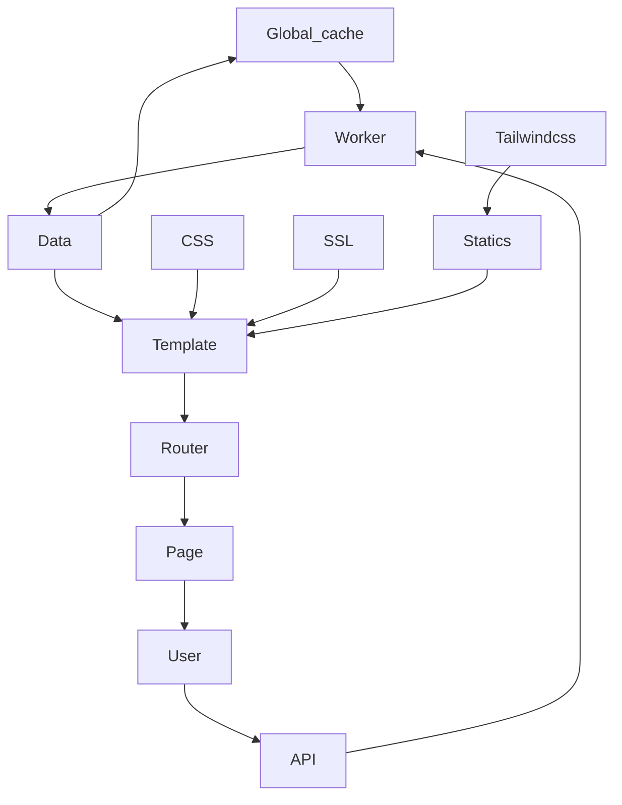

# Developer Guide

# Overview
directories:
- barcode: Additional barcode generator and additional image.
- data: the place where book data is stored.
- routers: page and api management.
- statics: assets.
- tailwindcss: tailwind css interpreter
- templates: page HTML templates (Jinja 2)
- worker: labors that put your data

files:
- .gitignore: you know what it is.
- cert.pem, key.pem: self-signed ssl sign file.
- dependencies.py: public variable management (like very public variables (cache))
- dev.py: dev version of main.py that reloads on changes.
- main.py: deploy version.
- requirements.txt: the libraries.

# Structure

